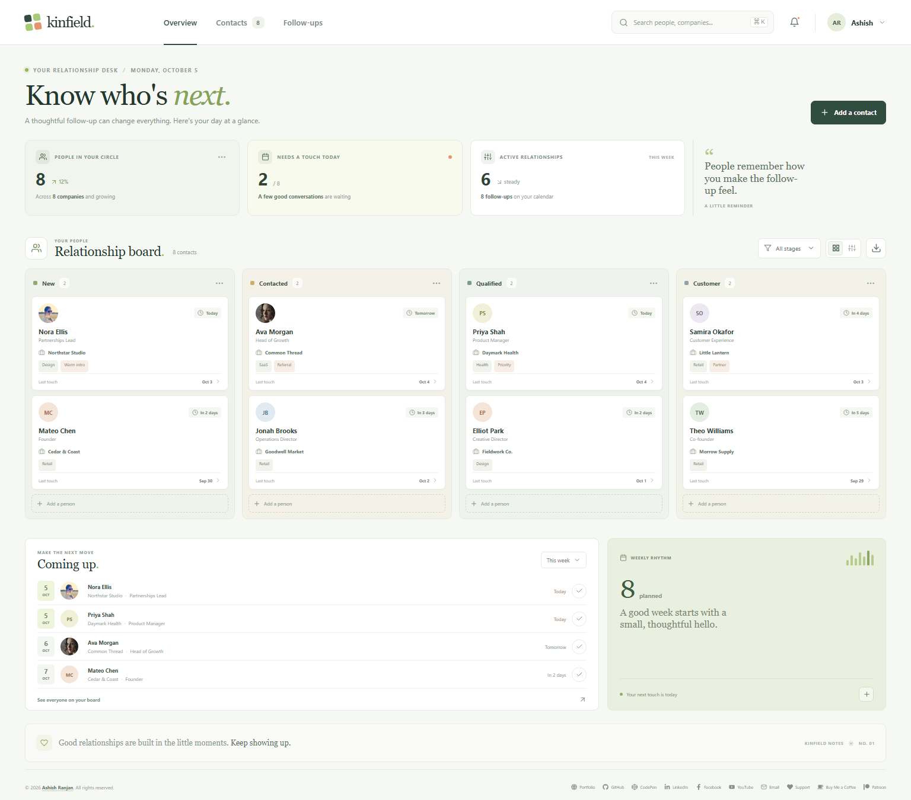

# Kinfield CRM Contact Board

Kinfield is a calm, practical workspace for organizing contacts, tracking relationship stages, and keeping thoughtful follow-ups on the calendar.

## Features

- A four-stage contact board with a list view
- Search by person, company, role, email, or tag
- Add and edit contact details, notes, tags, and follow-up dates
- Follow-up reminders with one-click completion
- CSV export for the full contact list
- Browser storage so your edits stay on this device
- Responsive layout for desktop and mobile screens

## Run locally

```sh
npm install
npm run dev
```

## Production build

```sh
npm run build
npm run preview
```

## Deploy to GitHub Pages

```sh
npm run deploy
```

The `predeploy` script builds the app first. The deploy command publishes `dist` to the `gh-pages` branch. The Vite base path and homepage URL match the project site so the built `index.html` can load its assets. GitHub Pages uses `gh-pages` and `/(root)` as its publishing source.
